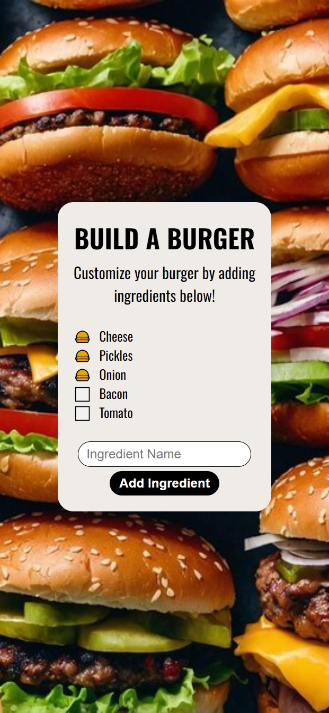

# Build a Burger

A fun, interactive burger builder that allows users to customize their own burger by adding and selecting ingredients. This project uses HTML, CSS, and JavaScript to give users the ability to create their perfect burger by choosing various ingredients, and the list of ingredients is saved in localStorage so it persists across sessions.

## Description

This project allows users to build a custom burger by adding ingredients and toggling the "done" state of each ingredient with a checkbox. The ingredients are displayed as a list, and users can add their own ingredients. The application saves the ingredients to `localStorage`, so they persist even if the page is refreshed. The burger builder interface features a responsive design with an eye-catching background, and is styled with Flexbox and modern CSS practices.

## Features

- Build your own burger by adding ingredients to a list.
- Toggle the "done" state of each ingredient with a checkbox.
- Ingredients persist between page refreshes using `localStorage`.
- Responsive design that adjusts to various screen sizes using `clamp()`.
- Interactive interface with smooth transitions.
- Clean and modern design with custom styling.

## Technologies Used

- HTML
- CSS
- JavaScript

## How to Run

1. Clone the repository to your local machine.
2. Open `index.html` in your web browser.
3. Alternatively, you can view the live project on GitHub Pages: [Build a Burger on GitHub Pages](https://deannamandarino.github.io/build-a-burger/).

## Acknowledgments

This project was completed as part of the JavaScript30 course. Special thanks to Wes Bos for the excellent resources and guidance throughout the course.